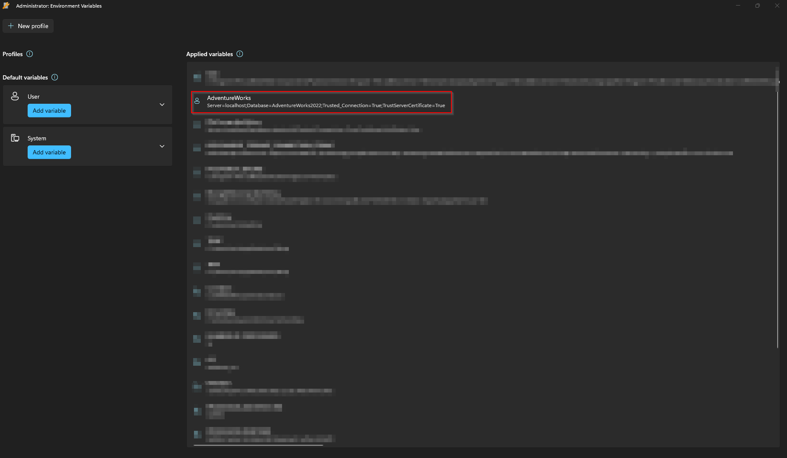

# API Example
This API is built to query data from the [MSFT AdventureWorks](https://learn.microsoft.com/en-us/sql/samples/adventureworks-install-configure?view=sql-server-ver16&tabs=ssms) dataset.  

If you want to try it out, import that dataset into your SQL Server, then set an environment variable with a connection string as the value.  
Set the `DbThing:DbConnectionStringKey` setting in `appsettings.Development.json`. Example:
```json
{
  "Logging": {
    "LogLevel": {
      "Default": "Information",
      "Microsoft.AspNetCore": "Warning"
    }
  },
  "DbThing": {
    "DbConnectionStringKey": "AdventureWorks" <<< Here!
  } 
}
```
